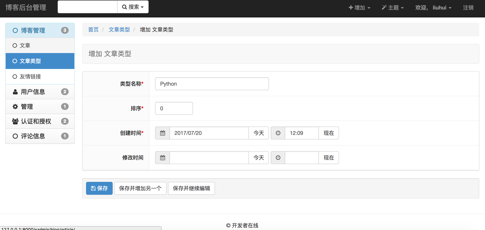
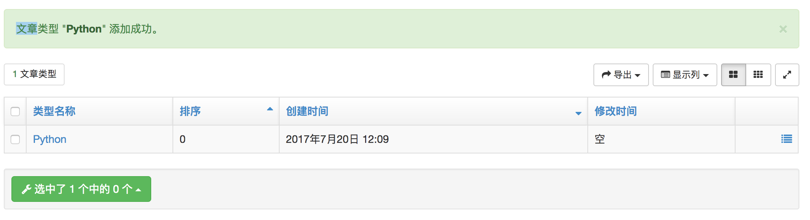
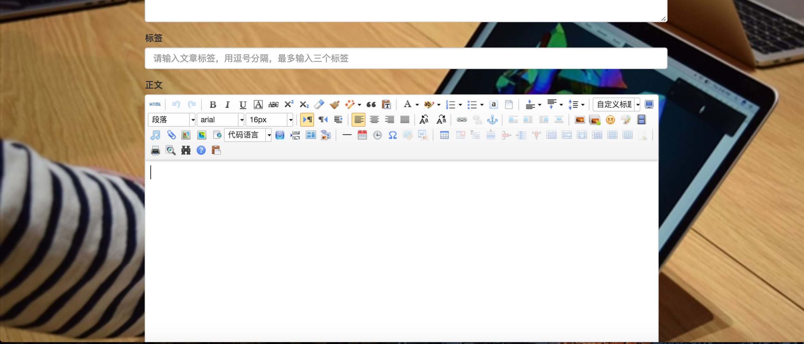

# 主要功能介绍(演示网站：http://120.79.153.16)
* 基于python3.5,django1.10.4的多用户博客论坛系统，集成了xadmin的后台管理，采用了djangoUeditor富文本处理文章。
* 多用户登录，注册，密码修改,上传头像
* 每个用户可以发表文章，评论别人的文章
* 每点击打开一篇文章，该文章访问量加1
* 文章有类型，标签，可以通过类型标签来筛选文章
* 热门文章，最新评论，友情链接
* 通过发表文章的数量，访问量和点赞数排出活跃的用户
* 参考了https://github.com/billvsme/vmaig_blog 和 https://github.com/zaxlct/imooc-django 等，非常感谢他们。

# 使用方法
1）安装python3.5,pip,virtualenv
* 安装python3.5和pip
```
yum install openssl-devel bzip2-devel expat-devel gdbm-devel readline-devel sqlite-devel
wget https://www.python.org/ftp/python/3.5.1/Python-3.5.1.tgz
tar -zxvf Python-3.5.1.tgz
mv Python-3.5.1 /usr/local
cd /usr/local/Python-3.5.1/
./configure
make && make install
ln -s /usr/local/bin/python3.5 /usr/bin/python3
```
* 安装virtualenv
```
pip3 install virtualenv
virtualenv dgblog
source dgblog/bin/activate
```
2）安装DjangoUeditor3（修改版，支持python3.5）
* 进入虚拟环境dgblog，下载git
```
yum install git -y
mkdir dgblogProject
cd dgblogProject
git clone https://github.com/liuhuipy/DjangoUeditor3.git
(dgblog) [root@VM_85_24_centos PyProjects]# cd DjangoUeditor3/
(dgblog) [root@VM_85_24_centos DjangoUeditor3]# ls
DUSite  DjangoUeditor  MANIFEST  TestApp  manage.py  readme.md  setup.py
(dgblog) [root@VM_85_24_centos DjangoUeditor3]# python setup.py install
```
3）下载djangoblog项目
```
cd ..
git clone https://github.com/liuhuipy/djangoblog.git
(dgblog) [root@VM_85_24_centos PyProjects]# ls
DjangoUeditor3  djangoblog
(dgblog) [root@VM_85_24_centos PyProjects]# cd djangoblog/
(dgblog) [root@VM_85_24_centos djangoblog]# ls
README.md  djangoblog  media             static
apps       manage.py   requirements.txt  templates
(dgblog) [root@VM_85_24_centos djangoblog]# pip install -r requirements.txt
(dgblog) [root@VM_85_24_centos djangoblog]# pip list                #列表下载的python包
Django (1.10.4)
django-crispy-forms (1.6.1)
django-debug-toolbar (1.8)
django-formtools (2.0)
django-haystack (2.6.1)
djangorestframework (3.6.3)
DjangoUeditor (1.8.143)
future (0.16.0)
httplib2 (0.10.3)
humanize (0.5.1)
olefile (0.44)
Pillow (4.2.1)
pip (9.0.1)
setuptools (36.0.1)
sqlparse (0.2.3)
wheel (0.29.0)
```
* 然后就可以开始创建了
```
python manage.py makemigrations
python manage.py migrate
python manage.py collectstatic
python manage.py createsuperuser              #创建超级用户  
python manage.py runserver                         #运行项目
```
* 访问127.0.0.1:8000
* 开始什么数据都没有,背景图片有点丑，建议换一个。。。

* 先进入后台管理


* 创建文章类型



* 添加文章

* 用户注册，登录

* 头像设置

* 发表文章


* 再次访问，大功告成！！！(其他操作略。。。)


